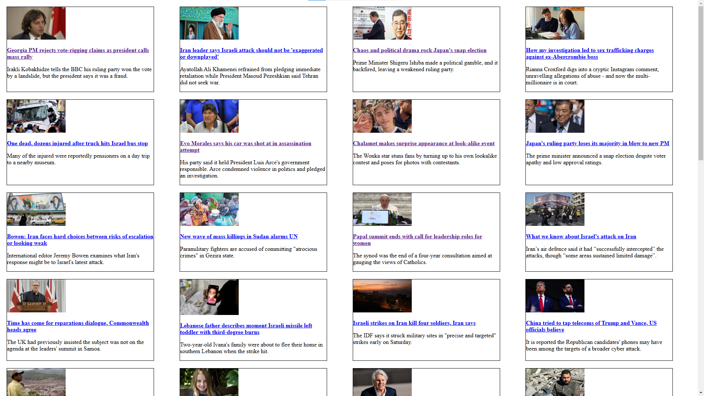

# BBC Newsboard

Create a newsboard using the [RSS feed of BBC](https://feeds.bbci.co.uk/news/world/rss.xml).

Make a request to the URL then parse the XML file using [ElementTree](https://python.readthedocs.io/en/stable/library/xml.etree.elementtree.html#module-xml.etree.ElementTree).

Using the [Jinja2 library](https://pypi.org/project/Jinja2/) create a template for the newsboard, where the card for the articles are loaded dynamically from the XML. Render the template with the help of the data you parsed from the XML and save in in an HTML file.

The final HTML file should look somewhat like this in your browser.



Adding the images is optional, since you have to interact with [XML namespaces](https://www.w3schools.com/xml/xml_namespaces.asp) which can be quite challenging in Python.

If you are still up to the challenge, you can hard-code the names of the namespaces in a dictionary that you need to use, or you can also make use of this code snippet to dynamically load the namespaces:

```
text = requests.get(link).text
first_line = text.split('\n')[0]
namespaces = {t[0]: t[1] for t in re.findall(r'xmlns:(?P<namespace>.*?)=\"(?P<url>.*?)\"', first_line)}
```

This code gets the first line of the XML and uses a Regular Expression to dynamically retrieve all the names of the namespaces (currently the XML module doesn't support this natively).